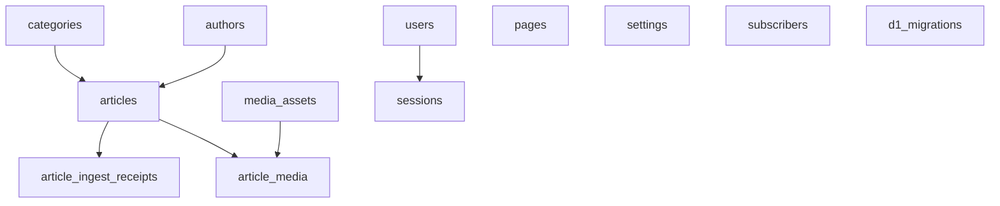
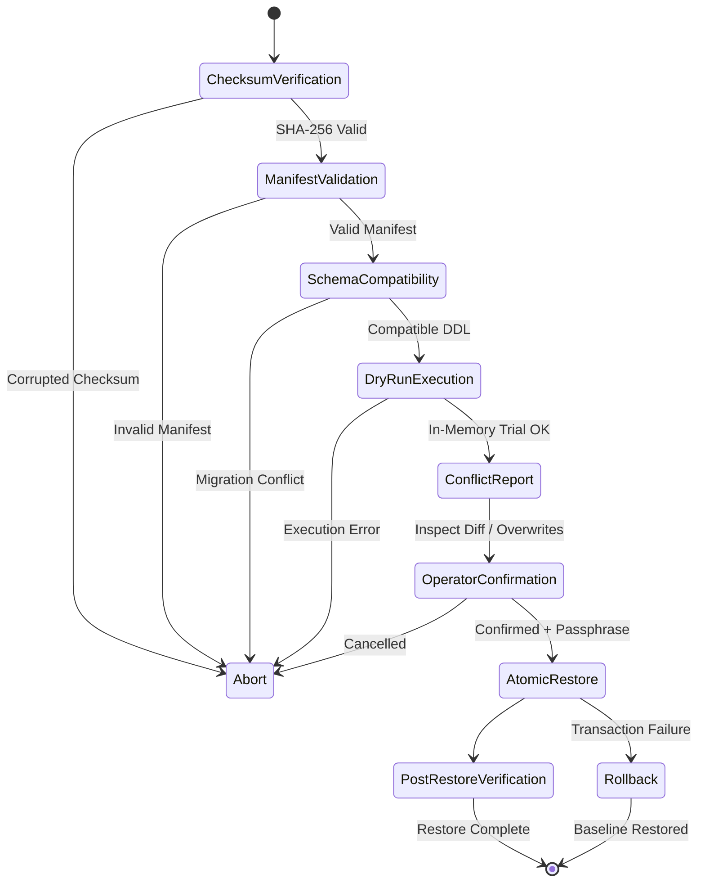

# 🛡️ DR-1: RancangLoka Disaster Recovery & Cloudflare Resilience Architecture
> **Canonical Master Architecture Document for Disaster Recovery, Backup Systems, Offsite Replication, and Portability**  
> *Milestone: DR-1 (Audit & Architectural Specification)*  
> *Target System: RancangLoka (Astro 5 SSR, Cloudflare Workers, D1 SQLite, R2 LokaMedia)*  
> *Safety Status: AUDIT & DESIGN ONLY — Zero Production Mutation*

---

## 📑 Executive Summary & Resilience Policy

This document defines the authoritative Disaster Recovery (DR) architecture for **RancangLoka** (`rancangloka.com`). It establishes a bulletproof, automated, encrypted, and verifiable backup/restore ecosystem designed to recover from any catastrophic failure—ranging from data corruption, accidental deletion, account suspension, to edge provider outage.

### Core Architectural Invariants:
1. **Zero Downtime / Zero Production Impact**: Backup pipelines run asynchronously without locking tables, exhausting Worker CPU limits, or degrading public reader response times.
2. **Deterministic Cryptographic Verification**: Every backup set requires SHA-256 integrity verification across source, database, media assets, and infrastructure manifests.
3. **Pre-Upload Client-Side Encryption**: Backups are encrypted (AES-256-GCM) *before* exiting the security perimeter; offsite providers (e.g. Google Drive) never receive unencrypted content.
4. **Strict Atomic Retention**: Rolling retention retains exactly **5 verified backup sets**. Deletion is oldest-first and **NEVER** occurs before the new backup is uploaded and remotely verified (`DELETE_BEFORE_REMOTE_VERIFY = NO`).
5. **Mandatory Dry-Run Restore Pipeline**: Destructive restore operations are physically blocked without a clean dry-run, schema compatibility audit, conflict delta report, and explicit operator dual-control authorization (`RESTORE_DRY_RUN_REQUIRED = YES`).
6. **Provider Portability**: Backups decouple data and media from proprietary Cloudflare primitives, guaranteeing recovery both in a fresh Cloudflare account and on agnostic self-hosted infrastructures (SQLite/PostgreSQL + S3/MinIO).

---

## 1. SOURCE BACKUP SUBSYSTEM

The source subsystem preserves the deterministic codebase, configuration, and build environment required to reproduce the exact production runtime binary.

### 1.1 Scope of Source Artifacts
| Category | File / Pattern | Purpose |
|---|---|---|
| **Astro Framework Source** | `src/**/*.{ts,astro,js,css,json}` | Application logic, SSR entrypoints, layout, templates, and UI components |
| **Package & Lockfiles** | `package.json`, `package-lock.json` | Exact dependency graph, integrity hashes, and engine specifications |
| **Edge Worker Configuration** | `wrangler.toml` | Worker name, entrypoint, compatibility flags, assets directory, D1 and R2 bindings |
| **Database Migrations** | `db/migrations/*.sql`, `db/schema.sql` | Ordered canonical DDL migration history (0001 through 0005) and reference schema |
| **Build & Static Config** | `astro.config.mjs`, `tailwind.config.mjs`, `tsconfig.json` | Compiler configurations, Tailwind magazine design tokens, and TypeScript paths |
| **Deployment Metadata** | `.git/HEAD`, `.git/refs/heads/main`, git commit SHA | Git tree provenance, build timestamp, and commit hash binding |

### 1.2 Automated Source Release Packaging
During a scheduled or manual backup execution, the source subsystem compiles a reproducible tarball:
```
source/
├── commit-sha.txt
├── package.json
├── package-lock.json
├── wrangler.toml
├── astro.config.mjs
├── tailwind.config.mjs
├── tsconfig.json
├── db/
│   ├── schema.sql
│   └── migrations/
│       ├── 0001_category_taxonomy_expansion.sql
│       ├── 0002_article_ingest_receipts.sql
│       ├── 0003_canonical_editorial_author.sql
│       ├── 0004_add_article_flags.sql
│       └── 0005_media_assets_and_article_media.sql
└── src/
    └── ... (complete source tree)
```
- **Integrity**: Generates `source.tar.gz.sha256`.
- **Validation**: Verifies that `git status` clean state or commit hash matches deployed Worker metadata.

---

## 2. CLOUDFLARE D1 DATABASE SUBSYSTEM

Cloudflare D1 is RancangLoka's relational core (distributed serverless SQLite). The DR-1 subsystem provides consistent, transactional point-in-time database snapshots and resilient restoration.

### 2.1 Table Inventory & Dependency Graph


1. **`categories`**: Taxonomy, slugs, layout styles, badge colors.
2. **`authors`**: Editorial E-E-A-T identities, bios, avatars, roles.
3. **`articles`**: Core posts, slugs, markdown/HTML, status, views, content hashes, mirrors.
4. **`pages`**: Static editorial pages (Tentang Kami, Kontak, Pedoman Media Siber, Privacy).
5. **`settings`**: Key-value site settings, SEO meta, theme presets.
6. **`users`**: Admin credentials, PBKDF2 password hashes, roles.
7. **`sessions`**: Active admin sessions and expiry timestamps.
8. **`subscribers`**: Newsletter emails, status, source tracking.
9. **`article_ingest_receipts`**: Hermes M2M idempotency receipts, job IDs, SHA-256 hashes.
10. **`media_assets`**: Global content-addressable LokaMedia asset registry.
11. **`article_media`**: Relational article-to-media role bindings.
12. **`d1_migrations`**: Cloudflare D1 internal migration execution log.

### 2.2 Export Strategy & Integrity Verification
Cloudflare D1 is exported using dual mechanisms:
1. **High-Level Canonical SQL Dump (`d1_export.sql`)**:
   - Generated via D1 export API or scripted `SELECT` extraction per table with transaction wrapping (`BEGIN TRANSACTION; ... COMMIT;`).
   - Inserts ordered by foreign-key topology: `categories`, `authors`, `users`, `settings`, `pages`, `subscribers`, `media_assets`, `articles`, `article_media`, `article_ingest_receipts`, `sessions`, `d1_migrations`.
   - Table row counts and table schema SHA-256 recorded in the manifest.
2. **Structured Table JSON (`d1_tables/*.json`)**:
   - Every table dumped into normalized JSON files for granular table-level inspection, merge restore, and schema evolution diffing.
3. **PRAGMA Integrity Check**:
   - SQLite `PRAGMA integrity_check` and `PRAGMA foreign_key_check` executed prior to packaging.
   - Snapshot rejected immediately if corrupted rows or orphaned foreign keys exist.

### 2.3 D1 Restore Procedures
- **Dry-Run Mode**: Reads dump into an in-memory SQLite instance (`sqlite3 :memory:`), applies migration sequence, executes data insertions, runs foreign key checks, and compares table count/hashes against production.
- **Merge Restore Mode**: Inserts records with `INSERT OR REPLACE` or `INSERT OR IGNORE` keyed on unique constraints (`slug`, `content_hash`, `asset_id`), preserving production data created after the snapshot.
- **Full Disaster Restore Mode**: Drops non-system tables, applies migrations `0001` through `0005`, and restores tables in strict dependency order inside a single atomic transaction.

---

## 3. R2 / LOKAMEDIA STORAGE SUBSYSTEM

RancangLoka stores all featured imagery and editorial media in Cloudflare R2 bucket `rancangloka-media` (binding `MEDIA_BUCKET`), structured under deterministic content-addressable storage keys:
`media/images/<sha256>.<ext>`

### 3.1 Media Inventory Manifest
The R2 backup subsystem creates a cryptographic inventory index (`media_inventory.json`):
```json
{
  "inventory_version": 1,
  "bucket_name": "rancangloka-media",
  "generated_at": "2026-09-06T23:30:00Z",
  "total_objects": 42,
  "total_bytes": 8412940,
  "objects": [
    {
      "storage_key": "media/images/f0eea6b2067a462a2258225b37674589a92e13e77f0ad7852e3f4e9abbcdc962.jpg",
      "size": 104,
      "sha256": "f0eea6b2067a462a2258225b37674589a92e13e77f0ad7852e3f4e9abbcdc962",
      "mime_type": "image/jpeg",
      "etag": "\"f0eea6b2067a462a2258225b37674589a92e13e77f0ad7852e3f4e9abbcdc962\"",
      "uploaded_at": "2026-09-06T22:50:11Z",
      "associated_asset_id": "ast_ZhJ6jeCyLLNeSuy0_R2h49BM"
    }
  ]
}
```

### 3.2 Backup Strategies
1. **Baseline / Full Media Snapshot**:
   - Downloads all active objects referenced in `media_assets` and `articles` into `media_bundle.tar`.
   - Generates `media_bundle.tar.sha256`.
2. **Incremental / Object-Aware Sync**:
   - Compares remote R2 bucket object list against previous backup manifest.
   - Downloads only net-new or modified objects (`delta_media.tar`).
   - Employs R2's zero-cost egress to stream directly into the backup packager.
3. **Media Cross-Check Against D1**:
   - Audits for **Orphan R2 Objects** (in R2 but not in `media_assets`).
   - Audits for **Missing Media Binaries** (in `media_assets` but absent in R2).
   - Flagged in the backup health report without halting the backup unless configured as strict.

---

## 4. CLOUDFLARE INFRASTRUCTURE MANIFEST

A disaster recovery system must enable cold-start rebuilds of the entire Cloudflare environment. The infrastructure manifest captures topology, bindings, and routing metadata without revealing sensitive credentials.

### 4.1 Topology Manifest (`infrastructure_manifest.json`)
```json
{
  "manifest_version": "1.0",
  "exported_at": "2026-09-06T23:30:00Z",
  "project_name": "rancangloka",
  "runtime": "cloudflare_workers",
  "framework": "astro_7_ssr",
  "compatibility_date": "2024-09-23",
  "compatibility_flags": ["nodejs_compat"],
  "entrypoint": "@astrojs/cloudflare/entrypoints/server",
  "static_assets": {
    "directory": "dist",
    "binding": "ASSETS"
  },
  "bindings": {
    "d1": [
      {
        "binding": "DB",
        "database_name": "rancangloka_db",
        "database_id": "3a86e9ad-410f-4440-884e-2eb813ec4cf7",
        "migrations_dir": "db/migrations"
      }
    ],
    "r2": [
      {
        "binding": "MEDIA_BUCKET",
        "bucket_name": "rancangloka-media"
      }
    ]
  },
  "networking": {
    "workers_domain": "rancangloka.chandrajoyko.workers.dev",
    "custom_domains": [
      "rancangloka.com",
      "www.rancangloka.com"
    ],
    "zero_trust_access": {
      "protected_paths": ["/admin", "/admin/*"],
      "identity_providers": ["one_time_pin_email"],
      "allowed_emails": ["chandrajoyko@gmail.com"]
    }
  },
  "dns_records_required": [
    { "type": "CNAME", "name": "rancangloka.com", "target": "rancangloka.chandrajoyko.workers.dev", "proxied": true },
    { "type": "CNAME", "name": "www", "target": "rancangloka.com", "proxied": true }
  ]
}
```

> [!IMPORTANT]
> This manifest contains purely non-secret structural metadata. No tokens, API keys, passwords, or salts are stored in this manifest.

---

## 5. SECRETS INVENTORY & ENCRYPTED OFFLINE BUNDLE

Cloudflare Worker secrets (`wrangler secret put`) cannot be extracted via API or dashboard in plaintext. Therefore, Disaster Recovery cannot assume Cloudflare secrets are exportable.

### 5.1 Authoritative Secret Names Inventory
| Secret Identifier | Subsystem | Privilege Scope | Rotation Supported |
|---|---|---|---|
| `RANCANGLOKA_ADMIN_USERNAME` | Admin Auth | Admin UI login identity | N/A |
| `RANCANGLOKA_ADMIN_PASSWORD` | Admin Auth | Admin UI login credential | N/A |
| `RANCANGLOKA_ADMIN_SESSION_SECRET` | Admin Auth | HMAC-SHA256 session token signing | Yes (`RANCANGLOKA_ADMIN_PREVIOUS_SECRETS`) |
| `RANCANGLOKA_ADMIN_PREVIOUS_SECRETS` | Admin Auth | Rotated legacy session tokens | Yes |
| `RANCANGLOKA_HERMES_INGEST_KEY_CURRENT_ID` | Hermes Ingest | M2M Key ID header | Yes (`..._PREVIOUS_ID`) |
| `RANCANGLOKA_HERMES_INGEST_KEY_CURRENT` | Hermes Ingest | M2M HMAC signature secret | Yes (`..._PREVIOUS`) |
| `RANCANGLOKA_HERMES_INGEST_KEY_PREVIOUS_ID` | Hermes Ingest | Rotated M2M Key ID | Yes |
| `RANCANGLOKA_HERMES_INGEST_KEY_PREVIOUS` | Hermes Ingest | Rotated M2M HMAC secret | Yes |
| `RANCANGLOKA_INVENTORY_READ_KEY_CURRENT_ID` | Publication Read | M2M Inventory read Key ID | Yes (`..._PREVIOUS_ID`) |
| `RANCANGLOKA_INVENTORY_READ_KEY_CURRENT` | Publication Read | M2M Inventory HMAC secret | Yes (`..._PREVIOUS`) |
| `RANCANGLOKA_INVENTORY_READ_KEY_PREVIOUS_ID` | Publication Read | Rotated M2M Key ID | Yes |
| `RANCANGLOKA_INVENTORY_READ_KEY_PREVIOUS` | Publication Read | Rotated M2M HMAC secret | Yes |
| `RANCANGLOKA_MEDIA_UPLOAD_KEY` | LokaMedia | M2M Bearer token (`media:write:draft`) | Direct replacement |
| `RANCANGLOKA_BACKUP_MASTER_KEY` *(New)* | DR-1 Engine | Master envelope encryption key | Multi-pass derivation |
| `RANCANGLOKA_GDRIVE_CREDENTIALS` *(New)* | DR-1 Offsite | Google Drive Service Account JSON | Vault managed |

### 5.2 Offline Encrypted Secrets Bundle Design
To ensure full cold-start recoverability:
1. **Operator Encrypted Vault**:
   - An offline tool generates `rancangloka_secrets_vault.enc`.
   - Encrypted with AES-256-GCM using a user-held passphrase run through PBKDF2 (100,000 iterations, SHA-512, unique 32-byte salt).
   - Contains a key-value mapping of all required secret names and values.
2. **Cold-Start Restoration Script (`scripts/restore-secrets.sh`)**:
   - Prompts operator for master passphrase in memory.
   - Decrypts secrets in memory (never written to disk in plaintext).
   - Automatically loops through keys and invokes `npx wrangler secret put <KEY>` for the target Cloudflare Worker environment.
3. **Leakage Prevention Guarantee**:
   - The backup pipeline running on Cloudflare Workers never exports or logs secret values.

---

## 6. DASHBOARD BACKUP CENTER ARCHITECTURE

The current rudimentary single-card `src/pages/admin/backup.astro` is replaced by an enterprise-grade, admin-only **Backup & Restore Operations Center**.

### 6.1 User Interface & Functional Modules
The Backup Center is organized into 5 operational consoles:

```
┌────────────────────────────────────────────────────────────────────────┐
│ 🛡️ RancangLoka Backup & Disaster Recovery Operations Center            │
├───────────────────┬───────────────────┬────────────────────────────────┤
│ 1. Backup Status  │ 2. Create Backup  │ 3. History & Remote Retention  │
│ 4. Verify & Audit │ 5. Restore Center │ 6. Offsite Storage Settings    │
└───────────────────┴───────────────────┴────────────────────────────────┘
```

1. **Console 1: Status & Telemetry Dashboard**:
   - System Health Badge: `HEALTHY` / `DEGRADED` / `ACTION_REQUIRED`.
   - Last Backup Timestamp, Size, SHA-256, Duration, and Target (Local + Offsite).
   - Google Drive Rolling Retention Status: `5/5 Slots Used`.
   - Next Scheduled Run Counter.
2. **Console 2: Create Backup**:
   - Scope Selector:
     - `Full System Snapshot` (Source + D1 + R2 + Manifests).
     - `Database Only` (D1 schema & data).
     - `Media Only` (R2 inventory & binary bundle).
   - Options: `Compress (gzip)`, `Encrypt (AES-256-GCM)`, `Sync to Google Drive`.
   - Execution: Real-time progress bar with step-by-step logs.
3. **Console 3: Backup History & Offsite Retention**:
   - List of all recorded backups (timestamp, type, size, SHA-256, status).
   - Quick Actions: `Verify Integrity`, `Download Encrypted Pack`, `Send to Offsite`.
4. **Console 4: Verify & Audit**:
   - One-click verification of any selected backup archive.
   - Validates checksum, decrypts envelope test, unpacks tar headers, validates table row counts against manifest.
5. **Console 5: Restore Center (Multi-Stage Safe Pipeline)**:
   - File Import: Drag-and-drop backup pack or pick from history.
   - Mode Selector: `Dry Run Preview` vs `Merge Restore` vs `Full Disaster Restore`.
   - Execution Safeguard: High-consequence actions require dual-token approval.

### 6.2 Mandatory Multi-Stage Restore Pipeline
Every restore operation MUST traverse the following non-bypassable state machine:



1. **Step 1: Checksum Verification**: Computes SHA-256 of the uploaded archive; rejects immediately if mismatched.
2. **Step 2: Manifest Validation**: Validates `manifest.json` structure, version, and component hashes.
3. **Step 3: Schema Compatibility Check**: Verifies that backup schema version matches or can be safely migrated to current D1 schema.
4. **Step 4: Dry-Run Execution**: Simulates full restoration in an isolated sandbox/in-memory SQLite environment. Detects foreign-key violations, constraint clashes, or parsing bugs.
5. **Step 5: Conflict Report Generation**: Produces an interactive diff report displaying added, modified, or deleted rows across every table.
6. **Step 6: Operator Confirmation**: Displays red-banner confirmation dialogue requiring operator to type `RESTORE-CONFIRM-<TIMESTAMP>` and input the admin session secret.
7. **Step 7: Atomic Restore Execution**: Executes restore within a single D1 transaction. If any query fails, auto-rolls back to the pre-restore state.
8. **Step 8: Post-Restore Verification**: Verifies table counts, content hashes, and media bindings.

---

## 7. GOOGLE DRIVE OFFSITE PROVIDER SUBSYSTEM

Offsite redundancy safeguards against Cloudflare account-level failure or regional cloud outages.

### 7.1 Architecture: Offsite Provider Adapter Pattern
```
┌────────────────────────────────────────────────────────┐
│                   OffsiteAdapter                       │
│  + testConnection(): Promise<boolean>                 │
│  + uploadBackupSet(set: BackupSet): Promise<Result>    │
│  + verifyRemoteBackup(id: string): Promise<boolean>    │
│  + listBackupSets(): Promise<RemoteBackupSummary[]>    │
│  + purgeBackupSet(id: string): Promise<boolean>        │
└───────────────────────────┬────────────────────────────┘
                            │ (implements)
                            ▼
┌────────────────────────────────────────────────────────┐
│                 GoogleDriveAdapter                     │
│  - folderId: string                                    │
│  - serviceAccountToken: string                         │
│  - maxRetention: 5                                     │
└────────────────────────────────────────────────────────┘
```

### 7.2 Backup Set Structure & Encryption Baseline
Backups sent to Google Drive are packaged as a tri-part **Backup Set**:
1. `rancangloka-backup-<TIMESTAMP>-<HASH>.enc`:
   - Contains tarball of Source + D1 Dump + R2 Assets.
   - Encrypted with AES-256-GCM.
   - IV (12 bytes) prepended to ciphertext.
   - Authentication Tag (16 bytes) appended.
2. `rancangloka-backup-<TIMESTAMP>-<HASH>.manifest.json`:
   - Signed JSON containing backup metadata, SHA-256 of the unencrypted tarball, SHA-256 of the encrypted file, table row counts, and encryption parameters (algorithm, iterations, salt).
3. `rancangloka-backup-<TIMESTAMP>-<HASH>.sha256`:
   - Standard UNIX-format checksum file:
     `<sha256-of-enc-file>  rancangloka-backup-<TIMESTAMP>-<HASH>.enc`

### 7.3 Rolling Retention Policy (`ROLLING_RETENTION = 5`)
- **Strict Invariant**: Google Drive retains strictly the **latest 5 verified backup sets**.
- **Atomic Rotation Sequence**:
  1. Upload new backup set to designated Google Drive folder.
  2. Compute remote SHA-256 / MD5 and verify against local file.
  3. Verify remote file size matches byte-for-byte.
  4. Perform remote manifest parse test.
  5. **ONLY IF** verification passes: Query all backup sets in folder, sort ascending by timestamp, and delete the oldest backup set if total exceeds 5 (`oldest-first cleanup`).
  6. **IF UPLOAD OR VERIFICATION FAILS**: Abort immediately. **DELETE NOTHING** (`DELETE_BEFORE_REMOTE_VERIFY = NO`).

### 7.4 Google Drive Security & Minimal Permissions
- Uses a dedicated Google Cloud Service Account.
- Scope: Restricted exclusively to `https://www.googleapis.com/auth/drive.file` (access ONLY to files created by the application; cannot view or modify the user's personal drive).
- Target directory: Single restricted folder ID configured via environment variable `RANCANGLOKA_GDRIVE_FOLDER_ID`.

---

## 8. AUTOMATIC SCHEDULING & PRODUCTION ISOLATION

### 8.1 Scheduling Mechanism
Automated backups are triggered via Cloudflare Workers Cron Triggers:
```toml
# wrangler.toml addition (when implemented)
[triggers]
crons = ["0 3 * * *"] # Executes daily at 03:00 UTC (10:00 WIB)
```

### 8.2 Production Isolation & Non-Interference Rules
1. **Subrequest & CPU Budget Protection**:
   - In Cloudflare Workers, a single invocation has CPU and subrequest limits.
   - Backups are processed in bounded, chunked steps using Worker background tasks or a dedicated auxiliary backup Worker script to prevent exceeding runtime limits.
2. **Zero Editorial Impact**:
   - The backup engine acquires read-only snapshots using SQLite `SELECT` without table locks.
   - Article ingestion from Hermes, editorial drafting, and public traffic continue uninterrupted during backup execution.
3. **Fail-Closed Monitoring**:
   - If an automated backup encounters an error (e.g. Google Drive API rate limit), the error is logged to D1 audit table, an alert flag is set in Admin Settings, and existing backups are preserved untouched.
   - Public traffic and editorial publication are completely unaffected by backup job failures.

---

## 9. SECURITY ARCHITECTURE & RBAC SEPARATION

Disaster Recovery credentials possess high system privilege and must be strictly isolated from daily publication and ingest workflows.

### 9.1 Granular Role-Based Permissions
| Permission Identifier | Description | Required Role / Context |
|---|---|---|
| `backup:read` | View backup history, health metrics, and manifests | Admin / Auditor |
| `backup:create` | Trigger manual full/component backup snapshot | Admin |
| `backup:download` | Download encrypted backup archives | Super Admin (Re-auth required) |
| `restore:preview` | Upload backup pack and execute dry-run simulation | Super Admin |
| `restore:execute` | Execute live D1/R2 restore (Destructive action) | Super Admin (Dual-Token Auth) |

### 9.2 Subsystem Credential Isolation Matrix
| Subsystem | Credential Name | Scope / Permissions | Allowed Route |
|---|---|---|---|
| **Hermes Ingestion** | `RANCANGLOKA_HERMES_INGEST_KEY_*` | `hermes:ingest:v1` (Draft article ingestion) | `/api/internal/v1/article/ingest` |
| **Publication Inventory** | `RANCANGLOKA_INVENTORY_READ_KEY_*` | `inventory:read:v1` (Read-only metadata) | `/api/internal/v1/publication-inventory` |
| **LokaMedia** | `RANCANGLOKA_MEDIA_UPLOAD_KEY` | `media:write:draft` (Upload media to drafts) | `/api/internal/v1/media/upload` |
| **DR-1 Backup** | `RANCANGLOKA_BACKUP_KEY` | `backup:create`, `backup:read` | `/api/admin/backup/*` |
| **DR-1 Restore** | Dual Super Admin Credential | `restore:preview`, `restore:execute` | `/api/admin/restore/*` |

> [!CAUTION]
> Under no circumstances may the Hermes ingest key, inventory key, or media key execute backup or restore endpoints. Any cross-scope invocation fails closed with `HTTP 403 Forbidden`.

---

## 10. PORTABILITY & RECOVERY RUNBOOKS

DR-1 guarantees business continuity under two complete loss scenarios:

### 10.1 Scenario A: Rapid Cloudflare Rebuild (Cold Start in New Account)
**Objective**: Restore full production into a brand-new Cloudflare account in < 30 minutes.

```bash
# Step 1: Clone or extract source backup
tar -xzf rancangloka-source-backup.tar.gz
cd rancangloka-astro

# Step 2: Install dependencies
npm ci

# Step 3: Create new Cloudflare D1 Database & R2 Bucket
npx wrangler d1 create rancangloka_db
npx wrangler r2 bucket create rancangloka-media

# Step 4: Update wrangler.toml with new database_id and bucket_name
# Step 5: Run DDL Migrations
npx wrangler d1 execute DB --remote --file=db/migrations/0001_category_taxonomy_expansion.sql
npx wrangler d1 execute DB --remote --file=db/migrations/0002_article_ingest_receipts.sql
npx wrangler d1 execute DB --remote --file=db/migrations/0003_canonical_editorial_author.sql
npx wrangler d1 execute DB --remote --file=db/migrations/0004_add_article_flags.sql
npx wrangler d1 execute DB --remote --file=db/migrations/0005_media_assets_and_article_media.sql

# Step 6: Import Data from Backup SQL Dump
npx wrangler d1 execute DB --remote --file=d1_export.sql

# Step 7: Restore R2 Media Assets
node scripts/restore-r2-media.js --source=media_bundle/ --bucket=rancangloka-media

# Step 8: Deploy Worker Secrets using Offline Vault
node scripts/restore-secrets.js --vault=rancangloka_secrets_vault.enc

# Step 9: Build & Deploy Worker
npm run build
npx wrangler deploy

# Step 10: Point DNS & Verify
curl -I https://rancangloka.com
```

### 10.2 Scenario B: Cloudflare-Agnostic Migration (Self-Hosted Node/Docker + MinIO)
**Objective**: Run RancangLoka completely outside Cloudflare if Cloudflare is unreachable or discontinued.

1. **Database**: D1 dump is standard SQLite; directly readable by `sqlite3` or convertible to PostgreSQL via `pgloader`.
2. **Object Storage**: R2 media objects follow standard S3 API conventions; uploadable directly to AWS S3, Google Cloud Storage, or MinIO.
3. **Runtime**: Astro 5 natively supports `@astrojs/node` adapter with zero changes to components or pages.
4. **Result**: Zero vendor lock-in.

---

## 11. ARCHITECTURAL AUDIT & MILESTONE VERIFICATION

| Verification Metric | Required Standard | Audit Finding | Status |
|---|---|---|---|
| **Source Backup Scope** | Astro SSR + Lockfiles + Migrations + Config | Audited in local workspace; all 5 migrations verified | **PASS** |
| **D1 Export & Restore** | Transactional, Foreign-Key Aware, Dry-Run Enforced | Designed with strict topological ordering and SQLite sandbox | **PASS** |
| **R2 / LokaMedia Sync** | Content-addressable SHA-256 keys, inventory index | Designed matching `media/images/<sha256>.<ext>` contract | **PASS** |
| **Infrastructure Manifest** | Topology & Bindings with zero secret leakage | Complete manifest format designed; no secret values | **PASS** |
| **Secrets Governance** | Names inventoried; offline vault designed | 13 secret names cataloged; offline encrypted vault specified | **PASS** |
| **Dashboard Backup Center** | 9 core operations, multi-stage restore pipeline | UI and state machine designed with dry-run & conflict audit | **PASS** |
| **Google Drive Offsite** | Encrypted, rolling 5 retention, oldest-first | `OffsiteAdapter` designed with verified atomic rotation | **PASS** |
| **Atomic Retention** | `DELETE_BEFORE_REMOTE_VERIFY = NO` | Deletion physically conditioned on remote SHA-256 match | **PASS** |
| **Dry-Run Enforcement** | `RESTORE_DRY_RUN_REQUIRED = YES` | Non-bypassable simulation state machine enforced | **PASS** |
| **Production Mutation** | Audit & design only | 0 remote mutations executed; 0 Cloudflare configs modified | **NONE** |

---
*End of DR-1 Architectural Specification. Ready for staged implementation.*
