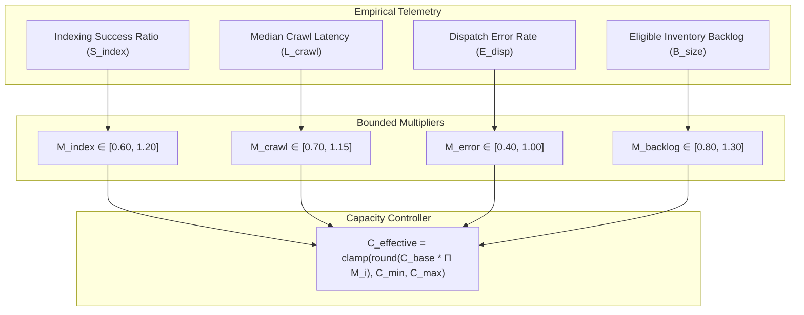
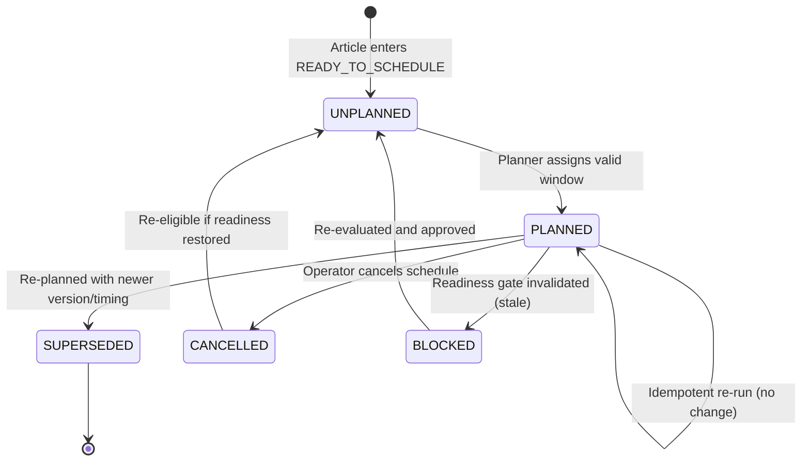
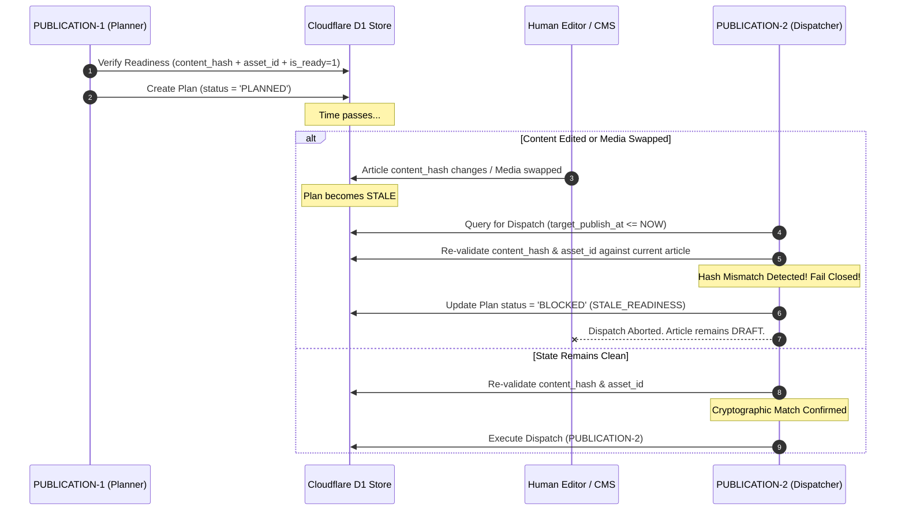
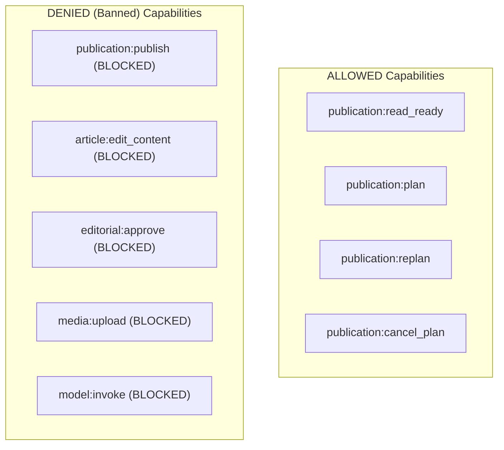

# 🗓️ RancangLoka Adaptive Publication Planner — Architecture & System Design (PUBLICATION-1)

**Document Version:** 1.0.0  
**Milestone:** PUBLICATION-1 — Adaptive Publication Planner Audit & Design  
**Status:** DESIGN FREEZE / AUDIT COMPLETE (Zero Implementation / Zero Production Mutation)  
**Date:** 2026-09-07  

---

## 1. Executive Summary & Design Scope

Milestone **PUBLICATION-1 (Adaptive Publication Planner)** designs the deterministic, adaptive, and quota-conscious planning engine that sequences verified `READY_TO_SCHEDULE` draft articles into optimal, natural, and auditable publication windows:

$$\mathbf{READY\_TO\_SCHEDULE}\;(\text{PUBLICATION-0}) \longrightarrow \text{Adaptive Capacity \& Spacing Planner} \longrightarrow \mathbf{PLANNED}\;(\text{PUBLICATION-1})$$

The planner's sole responsibility is **capacity-aware temporal sequencing**:
1. Ingest only articles that have achieved cryptographic, editorial, and visual readiness under **PUBLICATION-0**.
2. Calculate the safe daily publication capacity ($C_{\text{effective}}$) based on the domain's current maturity profile and empirical health signals.
3. Prioritize ready inventory using a deterministic, non-LLM ranking function.
4. Assign discrete, staggered publication windows in the operational timezone (**`Asia/Jakarta`** / WIB).
5. Apply deterministic, reproducible jitter to eliminate mechanical burst publishing.
6. Enforce strict category and topic spacing to protect taxonomic breadth.
7. Persist auditable, immutable publication plans in state **`PLANNED`**.

### Hard System Boundaries & Prohibitions
- **Does NOT Publish:** PUBLICATION-1 does **NOT** publish articles or mutate public routes. `PUBLIC_PUBLISH = NO`.
- **Does NOT Dispatch:** PUBLICATION-1 does **NOT** transition articles to `scheduled` or `published` in the CMS. Actual execution is delegated to **PUBLICATION-2** (Publishing Dispatcher).
- **Does NOT Call AI/LLMs:** Planning, capacity calculations, and ranking are 100% deterministic mathematical algorithms. `MODEL_CALLS = 0`.
- **Does NOT Mutate Content:** Articles remain strictly intact in their exact ingested form. `content_hash` and Markdown content are immutable. `ARTICLE_EDIT_PERMISSION = NO`.
- **Does NOT Enforce Fixed Quotas:** There is **NO** permanent "20 articles per day" rule. 20/day is merely an upper ceiling for a specific growth profile. `FIXED_20_PER_DAY = NO`.
- **Zero Production Mutation:** This milestone is strictly **Audit & Design**. No tables are altered, no code is deployed, and `AUTO_PUBLISH = OFF`.

---

## 2. Audit of Existing Production Architecture

A thorough inspection of RancangLoka's production CMS (`rancangloka-astro`), Hermes outbox platform, and Cloudflare D1 database confirms the following architectural baselines:

### 2.1 PUBLICATION-0 Readiness Baseline
- **Readiness Gate Table (`article_publication_readiness`):**
  - Evaluates 6 distinct vectors: Article Integrity, Editorial Guards, Grounding & Citations, Visual Media, Human Approval, and Metadata.
  - Immutably records `is_ready IN (0, 1)`, `overall_status IN ('READY_TO_SCHEDULE', 'NOT_READY', 'BLOCKED')`, `content_hash`, and complete vector JSON.
- **Editorial Approvals Table (`article_editorial_approvals`):**
  - Stores explicit sign-offs by `editor_in_chief` or `managing_editor`.
  - Cryptographically bound to `approved_content_hash` and `approved_asset_id`.
  - Statuses: `'APPROVED' | 'REJECTED' | 'REVOKED'`.
- **Canonical Eligibility Query (`getArticlesReadyToSchedule`):**
  ```sql
  SELECT a.id, a.slug, a.title, a.status, a.content_hash,
         r.is_ready, r.overall_status, r.evaluated_at, r.snapshot_json
  FROM articles a
  JOIN article_publication_readiness r ON a.id = r.article_id
  WHERE a.status = 'draft'
    AND r.is_ready = 1
    AND a.content_hash = r.content_hash
    AND r.id = (
      SELECT id FROM article_publication_readiness
      WHERE article_id = a.id
      ORDER BY evaluated_at DESC, id DESC
      LIMIT 1
    )
  ORDER BY r.evaluated_at ASC;
  ```
  Only records returned by this exact fail-closed query are legally eligible for PUBLICATION-1 planning.

### 2.2 Articles Schema & Public Isolation (`articles` table)
- `articles.status`: Enum constrained to `'draft' | 'published' | 'scheduled'`.
- `articles.published_at`: Nullable datetime, currently `DEFAULT CURRENT_TIMESTAMP`.
- Public surface behavior (`src/pages/[slug].astro`, `src/lib/db.ts`):
  - `getPublishedArticleBySlug`: Enforces `WHERE a.slug = ? AND a.status = 'published'`. Draft and scheduled articles unconditionally return HTTP 404.
  - Sitemaps (`sitemap-posts-[page].xml.ts`, `sitemap-news.xml.ts`): Strictly filter on `getAllArticles(..., 'published')`.
  - RSS feeds and category archives exclude non-published content.
- **Audit Finding:** The `articles` table currently lacks a dedicated `scheduled_at` column. However, to preserve domain separation, target scheduling windows should be authored and audited in dedicated publication planning tables rather than overloading the CMS article record prematurely.

### 2.3 Strict Separation of Six Status Domains
To eliminate architectural ambiguity, RancangLoka enforces a strict separation across six decoupled lifecycle domains:

```mermaid
graph LR
    subgraph S1["1. CMS Lifecycle"]
        Art[articles.status<br/>draft | scheduled | published]
    end
    subgraph S2["2. Orchestrator"]
        Orch[orch_jobs.status<br/>QUEUED ... READY_FOR_REVIEW]
    end
    subgraph S3["3. Media Binary"]
        Med[media_assets.status<br/>PENDING ... VALIDATED]
    end
    subgraph S4["4. Readiness Gate"]
        Pub0[article_publication_readiness<br/>READY_TO_SCHEDULE | NOT_READY | BLOCKED]
    end
    subgraph S5["5. Publication Plan"]
        Pub1[article_publication_plans<br/>UNPLANNED | PLANNED | SUPERSEDED | CANCELLED | BLOCKED]
    end
    subgraph S6["6. Publish Dispatch"]
        Pub2[publish_dispatches<br/>PENDING_DISPATCH ... EXECUTED]
    end

    Art -.-> Pub0
    Med -.-> Pub0
    Pub0 ==> Pub1
    Pub1 ==> Pub2
    Pub2 ==> Art
```

| Domain | Authorized Values | Table | Owning Milestone |
| :--- | :--- | :--- | :--- |
| **1. Article CMS Status** | `'draft'`, `'scheduled'`, `'published'` | `articles` | Core CMS |
| **2. Orchestration State** | `QUEUED`, `GATHERING`, `WRITING`, `VALIDATING`, `WAITING_MEDIA`, `READY_FOR_REVIEW` | `orch_jobs` | ORCH-0 |
| **3. Media Lifecycle** | `PENDING`, `UPLOADING`, `VALIDATED`, `REJECTED`, `FAILED` | `media_assets` | MEDIA-0/1 |
| **4. Readiness Status** | `READY_TO_SCHEDULE`, `NOT_READY`, `BLOCKED` | `article_publication_readiness` | PUBLICATION-0 |
| **5. Publication Plan Status** | `UNPLANNED`, `PLANNED`, `SUPERSEDED`, `CANCELLED`, `BLOCKED` | `article_publication_plans` | **PUBLICATION-1** |
| **6. Publish Execution Status**| `PENDING_DISPATCH`, `DISPATCHING`, `EXECUTED`, `FAILED` | `publish_dispatches` | PUBLICATION-2 |

---

## 3. Planner Input Specification

The publication planner consumes only verified `READY_TO_SCHEDULE` inventory. For each candidate, it extracts deterministic metadata vectors:

```typescript
export interface PlannerCandidate {
  // Core Article Identity
  articleId: number;
  slug: string;
  title: string;
  categoryId: number;
  categorySlug: string;
  authorId: number;
  contentHash: string;
  
  // Readiness Provenance
  readinessSnapshotId: number;
  readinessEvaluatedAt: string; // ISO 8601 UTC
  approvedBy: string;
  approvedAssetId: string;
  
  // Metadata & Diversity Signals
  readingTimeMinutes: number;
  focusKeyword: string | null;
  keyTakeawaysCount: number;
  isFeatured: boolean;
  isTrending: boolean;
  isSponsored: boolean;
  
  // Priority & Timing Constraints
  operatorPriority: number; // 0 to 100, default 0
  requestedWindowStart?: string; // Optional human preference
  requestedWindowEnd?: string;
}
```

### Deterministic Input Handling & Conservative Defaults
- **Missing Topic/Keyword Data:** If `focus_keyword` is null or missing, the planner treats the article as generic within its category. It does **not** hallucinate or call an LLM to extract keywords.
- **Missing Freshness Hints:** If no deadline or embargo is specified, the article is treated as standard **evergreen** content.
- **Unverified Third-Party Signals:** If search analytics or indexing feedback is unavailable, the planner assumes **conservative neutral defaults** ($M_i = 1.00$). It never fabricates simulated crawl stats.

---

## 4. Adaptive Capacity Engine (Rejecting Fixed Quotas)

### 4.1 Rejection of "Fixed 20 Articles Per Day" Dogma
Hardcoding a single fixed daily volume (such as 20 articles/day) is an anti-pattern:
- For a new domain, publishing 20 unindexed articles daily can trigger search engine spam flags, dilute initial crawl budget, and create a long indexing queue.
- For a large, established authority site, 20 articles/day might unnecessarily constrain throughput.
- **20 articles/day is designated strictly as an upper ceiling for the `GROWING` profile**, not an immutable system constant.

### 4.2 Configurable Domain Maturity Profiles
The planner operates under four configurable operational profiles:

| Profile | Domain Context | Baseline Target ($C_{\text{base}}$) | Safety Ceiling ($C_{\max}$) | Min Spacing | Quiescent Hours |
| :--- | :--- | :---: | :---: | :---: | :---: |
| **`NEW`** | Age 0–3 months / Cold Start | **3–5** / day | **8** / day | 150 min | 22:00 – 07:00 |
| **`GROWING`** | Age 3–12 months / Indexing Healthy | **6–12** / day | **20** / day | 60 min | 22:00 – 07:00 |
| **`ESTABLISHED`** | Age 12+ months / High Authority | **15–25** / day | **40** / day | 30 min | 23:00 – 06:00 |
| **`HIGH_AUTHORITY`**| Verified Fast Indexing & High Crawl | **30–50** / day | **80** / day | 15 min | None (24h staggered) |

### 4.3 The "Quality Dominates Quota" Invariant
$$\text{Planned Volume} = \min\left(C_{\text{effective}}, N_{\text{eligible\_ready}}\right)$$

If only 3 articles pass the Readiness Gate on a given day, the planner schedules **exactly 3 articles**. It **never** relaxes quality gates, bypasses human approval, or synthesizes filler articles to meet a numerical target. Capacity is a **ceiling**, not an entitlement.

---

## 5. Adaptive Signals & Capacity Adjustment Logic

When historical feedback is present (from internal dispatch telemetry now, and the PUBLICATION-3 feedback bridge in the future), the planner dynamically scales daily capacity within the configured profile boundaries:

$$C_{\text{effective}} = \text{clamp}\left(\left\lfloor C_{\text{base}} \times M_{\text{index}} \times M_{\text{crawl}} \times M_{\text{error}} \times M_{\text{backlog}} \right\rfloor,\; C_{\min},\; C_{\max}\right)$$

### 5.1 Signal Multipliers



1. **Indexing Success Multiplier ($M_{\text{index}}$):**
   - Evaluates the ratio of articles indexed within 14 days of publication: $R_{\text{idx}} = N_{\text{indexed}} / N_{\text{published\_14d}}$.
   - $R_{\text{idx}} \ge 0.85$: $M_{\text{index}} = 1.15$ (Healthy indexation; safe to increment).
   - $0.60 \le R_{\text{idx}} < 0.85$: $M_{\text{index}} = 1.00$ (Normal baseline).
   - $R_{\text{idx}} < 0.60$: $M_{\text{index}} = 0.70$ (Indexation backlog detected; throttle output to conserve crawl budget).

2. **Crawl Latency Multiplier ($M_{\text{crawl}}$):**
   - Measures median days from publication to first Googlebot crawl:
   - $L_{\text{crawl}} \le 2\text{ days}$: $M_{\text{crawl}} = 1.10$.
   - $2\text{ days} < L_{\text{crawl}} \le 5\text{ days}$: $M_{\text{crawl}} = 1.00$.
   - $L_{\text{crawl}} > 5\text{ days}$: $M_{\text{crawl}} = 0.80$ (Crawlers are sluggish; slow down publication).

3. **Dispatch & Edge Error Multiplier ($M_{\text{error}}$):**
   - 5xx response rate or worker CPU execution timeouts over the last 48 hours:
   - $E_{\text{rate}} < 0.5\%$: $M_{\text{error}} = 1.00$.
   - $0.5\% \le E_{\text{rate}} < 2.0\%$: $M_{\text{error}} = 0.70$.
   - $E_{\text{rate}} \ge 2.0\%$: $M_{\text{error}} = 0.40$ (Platform instability; aggressively decelerate).

4. **Ready Inventory Backlog Multiplier ($M_{\text{backlog}}$):**
   - Days of ready content waiting: $D_{\text{backlog}} = N_{\text{ready}} / C_{\text{base}}$.
   - $D_{\text{backlog}} > 4$ (and indexation is healthy): $M_{\text{backlog}} = 1.25$ (Safely absorb backlog).
   - $D_{\text{backlog}} \le 4$: $M_{\text{backlog}} = 1.00$.

### 5.2 Transparent Explainability
Every capacity decision logs its constituent multipliers into `planner_runs.signals_json`. Black-box adjustments are strictly forbidden.

---

## 6. Temporal Distribution & Spacing ("No Magic SEO Hour")

### 6.1 Rejection of "Magic Hour" Mythology
Modern search engines do not operate on fixed, human-like appointment reading habits. Crawlers run continuously across distributed worker nodes. Claims that "10:00 AM WIB is the best hour for SEO" are scientifically unfounded. In contrast, dumping 10 articles at 10:00 AM creates artificial bursts that trigger anomaly detectors.

### 6.2 Operational Timezone: `Asia/Jakarta` (WIB, UTC+7)
All planning calculations, window boundaries, and operator interfaces standardize on **`Asia/Jakarta`**. Timestamps persisted in SQLite/D1 are stored as **ISO 8601 UTC**, with an accompanying local time string (`target_publish_local`) for human auditing.

### 6.3 Daily Distribution Model
1. **Operating Window:** 07:00:00 WIB to 22:00:00 WIB (15 hours = 900 minutes).
2. **Quiescent Period:** 22:00:00 WIB to 07:00:00 WIB (nighttime quiescent period for `NEW` and `GROWING` profiles).
3. **Equidistant Slot Base:**
   $$\Delta t_{\text{base}} = \frac{900\text{ minutes}}{N_{\text{planned}}}$$
   For $N = 5$ articles: $\Delta t_{\text{base}} = 180\text{ minutes}$ (3 hours between slots).

### 6.4 Deterministic Reproducible Jitter Algorithm
To avoid rigid mechanical schedules (e.g., publishing exactly at 07:00:00, 10:00:00, 13:00:00), the planner adds bounded deterministic jitter ($\pm 15\%$ of $\Delta t_{\text{base}}$, capped at $\pm 18$ minutes).

The jitter is generated via a cryptographically seeded pseudo-random number generator:

$$\text{Seed} = \text{SHA-256}\left(\text{date\_wib} + \text{":"} + \text{article\_id} + \text{":"} + \text{content\_hash} + \text{":"} + \text{planner\_version}\right)$$

```typescript
export function computeDeterministicJitter(
  dateStr: string,
  articleId: number,
  contentHash: string,
  plannerVersion: string,
  maxJitterMinutes: number
): number {
  const seedString = `${dateStr}:${articleId}:${contentHash}:${plannerVersion}`;
  const hash = crypto.createHash('sha256').update(seedString).digest('hex');
  // Extract integer from first 8 hex characters
  const intVal = parseInt(hash.slice(0, 8), 16);
  // Map uniformly to [-maxJitterMinutes, +maxJitterMinutes]
  const normalized = (intVal / 0xffffffff) * 2 - 1; // [-1.0, 1.0]
  return Math.round(normalized * maxJitterMinutes * 60); // jitter in seconds
}
```
**Guarantee:** Identical inputs yield the exact same publication timestamp down to the second.

### 6.5 Category & Topic Spacing Rules
1. **Category Anti-Clustering:** Two articles belonging to the **same category** must not be scheduled within $\tau_{\text{cat}}$ of each other:
   - For `NEW` profile: $\tau_{\text{cat}} \ge 240\text{ minutes}$ (or next calendar day).
   - For `GROWING` profile: $\tau_{\text{cat}} \ge 120\text{ minutes}$.
   - For `ESTABLISHED` profile: $\tau_{\text{cat}} \ge 60\text{ minutes}$.
2. **Topic Cannibalization Defense:** If two ready articles share the same `focus_keyword` or high slug token overlap ($> 60\%$), they must be separated by at least **72 hours** to avoid cannibalizing indexing focus.

---

## 7. Deterministic Inventory Prioritization

Candidate ranking runs purely on mathematical scoring, with **zero LLM involvement**:

$$\text{PriorityScore}(a) = S_{\text{age}}(a) + S_{\text{op}}(a) + S_{\text{balance}}(a) - P_{\text{cannibalism}}(a)$$

```typescript
export interface ScoringWeights {
  wAge: number;        // Weight for FIFO wait time (default: 0.35)
  wOperator: number;   // Weight for editor priority (default: 0.40)
  wBalance: number;    // Weight for taxonomy scarcity (default: 0.25)
  pCannibalism: number;// Penalty for topic proximity (default: 50.0)
}
```

### 7.1 Score Components
1. **Readiness Age ($S_{\text{age}}$):**
   $$S_{\text{age}} = \min\left(100,\; \frac{T_{\text{now}} - T_{\text{readiness\_eval}}}{3600\text{ sec}} \times 2.5\right)$$
   Prevents older ready articles from being starved by newer arrivals (FIFO baseline).
2. **Operator Priority ($S_{\text{op}}$):**
   Direct human editorial weight ($0 \le S_{\text{op}} \le 100$). Allows editors to fast-track time-sensitive editorial features.
3. **Taxonomy Balance ($S_{\text{balance}}$):**
   Calculated from the trailing 7-day publication count for the candidate's category:
   $$S_{\text{balance}} = \max\left(0,\; 100 - \frac{N_{\text{cat\_published\_7d}}}{\sum N_{\text{all\_published\_7d}}} \times 600\right)$$
   Under-represented categories receive a priority boost to maintain balanced domain breadth across RancangLoka's 6 architecture pillars.
4. **Cannibalism Penalty ($P_{\text{cannibalism}}$):**
   If an article shares keywords with an article published in the last 72 hours, it receives a substantial penalty ($-50$), pushing it behind unrelated articles.

---

## 8. Planning Lifecycle & Database Schema

PUBLICATION-1 introduces two dedicated relational tables to isolate planning state from CMS articles and readiness records.

### 8.1 Plan Lifecycle State Machine



### 8.2 D1 Database Schema (`0008_publication_planner.sql`)

```sql
-- 1. Table: article_publication_plans
-- Stores deterministic publication assignments generated by PUBLICATION-1
CREATE TABLE IF NOT EXISTS article_publication_plans (
    id INTEGER PRIMARY KEY AUTOINCREMENT,
    plan_id TEXT NOT NULL UNIQUE,                       -- E.g. 'plan_k8f92j4n8d'
    article_id INTEGER NOT NULL REFERENCES articles(id) ON DELETE CASCADE,
    readiness_id INTEGER NOT NULL REFERENCES article_publication_readiness(id),
    
    -- Cryptographic Invariants
    content_hash TEXT NOT NULL,                         -- Must match articles.content_hash
    featured_asset_id TEXT NOT NULL,                    -- Must match active featured media
    
    -- Publication Window Assignment
    target_publish_at DATETIME NOT NULL,                -- UTC ISO 8601
    target_publish_local TEXT NOT NULL,                 -- 'YYYY-MM-DD HH:MM:SS WIB'
    timezone TEXT NOT NULL DEFAULT 'Asia/Jakarta',
    
    -- Plan Classification & Provenance
    plan_status TEXT NOT NULL DEFAULT 'PLANNED',        -- PLANNED | SUPERSEDED | CANCELLED | BLOCKED
    planner_profile TEXT NOT NULL,                      -- 'NEW' | 'GROWING' | 'ESTABLISHED' | 'HIGH_AUTHORITY'
    planner_version TEXT NOT NULL DEFAULT '1.0.0',
    priority_score REAL NOT NULL,                       -- Computed sorting score
    slot_index INTEGER NOT NULL,                        -- Ordinal slot for the target day (1, 2, ...)
    jitter_seconds INTEGER NOT NULL DEFAULT 0,
    
    -- Audit & Traceability
    reason_codes TEXT NOT NULL,                         -- JSON Array: ['FIFO_AGE', 'CATEGORY_SPACED_180M']
    supersedes_plan_id TEXT REFERENCES article_publication_plans(plan_id),
    created_at DATETIME NOT NULL DEFAULT CURRENT_TIMESTAMP,
    updated_at DATETIME NOT NULL DEFAULT CURRENT_TIMESTAMP,

    CHECK (plan_status IN ('PLANNED', 'SUPERSEDED', 'CANCELLED', 'BLOCKED')),
    CHECK (timezone = 'Asia/Jakarta')
);

-- Indices for performance and concurrency protection
CREATE INDEX IF NOT EXISTS idx_plans_article_status 
ON article_publication_plans(article_id, plan_status);

CREATE INDEX IF NOT EXISTS idx_plans_target_time 
ON article_publication_plans(target_publish_at, plan_status);

-- Partial Unique Index: Exactly ONE active plan per article at any time
CREATE UNIQUE INDEX IF NOT EXISTS uq_active_plan_per_article 
ON article_publication_plans(article_id) 
WHERE plan_status = 'PLANNED';

-- 2. Table: publication_planner_runs
-- Audit log of every execution of the Publication Planner
CREATE TABLE IF NOT EXISTS publication_planner_runs (
    id INTEGER PRIMARY KEY AUTOINCREMENT,
    run_id TEXT NOT NULL UNIQUE,                        -- E.g. 'prun_938472918'
    planner_profile TEXT NOT NULL,
    planner_version TEXT NOT NULL,
    target_date TEXT NOT NULL,                          -- 'YYYY-MM-DD'
    
    -- Inventory Metrics
    eligible_count INTEGER NOT NULL,
    planned_count INTEGER NOT NULL,
    deferred_count INTEGER NOT NULL,
    blocked_count INTEGER NOT NULL,
    effective_capacity INTEGER NOT NULL,
    
    -- Telemetry & Diagnostic Data
    signals_json TEXT NOT NULL,                         -- Telemetry multipliers used
    explanations_json TEXT NOT NULL,                   -- Decision log per candidate
    created_at DATETIME NOT NULL DEFAULT CURRENT_TIMESTAMP
);

CREATE INDEX IF NOT EXISTS idx_planner_runs_date 
ON publication_planner_runs(target_date DESC, created_at DESC);
```

---

## 9. Stale Readiness Safety & Handoff Contract

### 9.1 The Tripartite Invalidation Protocol
A plan is valid **only while the article's underlying readiness remains unaltered**.



### 9.2 The PUBLICATION-2 Pre-Dispatch Check
PUBLICATION-2 **must never** blindly trust an existing `PLANNED` record. At the exact second of dispatch, it executes:
1. Verify `articles.status == 'draft'`.
2. Verify `articles.content_hash == plan.content_hash`.
3. Verify active featured `article_media.asset_id == plan.featured_asset_id`.
4. Verify latest `article_editorial_approvals.approval_status == 'APPROVED'`.
If any check fails, the plan transitions to `BLOCKED`, dispatch is canceled, and the article remains securely in `draft`.

---

## 10. Idempotency & Concurrency Design

### 10.1 Idempotency Guarantee
Running the planner $N$ times with the exact same inputs (same ready inventory, same configuration, same date) must produce the exact same plan without creating duplicate database rows:
- If an active plan already exists for an article and its computed `target_publish_at` matches within $\pm 1$ second, the record is untouched (`PLAN_UNCHANGED`).
- If inventory changes (e.g., a higher-priority article enters `READY_TO_SCHEDULE`), the planner runs a structured **Re-plan**:
  - The previous active plan is marked `SUPERSEDED`.
  - A new plan record is inserted with `supersedes_plan_id` linked to the previous ID.
  - Complete history is preserved in the database.

### 10.2 Concurrency Mutual Exclusion
To prevent split-brain planning from simultaneous scheduled triggers or admin requests:
1. **Database-Level Mutual Exclusion:** The partial unique index `uq_active_plan_per_article` strictly prevents an article from having two `PLANNED` rows simultaneously.
2. **Distributed Execution Lock:** Before running, the planner acquires an atomic lease in `settings` (`planner_lock: { worker_id, expires_at }`). Stale locks expire automatically after 180 seconds.

---

## 11. Human Editorial Control & Override System

The administrative interface (`/admin/publication/plans`) will expose explicit human controls:

| Action | API Endpoint | Description | Constraints |
| :--- | :--- | :--- | :--- |
| **Accept Plan** | `POST /api/admin/publication/plans/:id/accept` | Confirms an automated plan. | Requires `publication:plan` permission. |
| **Reschedule Window** | `PATCH /api/admin/publication/plans/:id` | Adjusts `target_publish_at`. | Must satisfy minimum category spacing ($\ge 60$m). Cannot bypass readiness. |
| **Prioritize Article** | `POST /api/admin/publication/plans/prioritize` | Moves candidate to next available slot. | Re-plans subsequent candidates downstream. |
| **Cancel Plan** | `POST /api/admin/publication/plans/:id/cancel` | Cancels plan; returns article to `UNPLANNED`. | Article remains `draft`. |
| **Pause Planner** | `POST /api/admin/publication/settings/pause` | Pauses automated schedule generation. | Existing plans remain frozen. |
| **Override Capacity** | `POST /api/admin/publication/settings/capacity` | Temporarily overrides daily quota. | Capped at $1.5 \times C_{\max}$ of current profile. |

**Inviolable Rule:** **No human override can ever schedule an article that is NOT `READY_TO_SCHEDULE`.** Readiness is a non-negotiable prerequisite.

---

## 12. Failure Modes & Safe Mode (Fail-Closed, Site-Safe)

| Failure Scenario | Engine Behavior | Impact on Public Site |
| :--- | :--- | :--- |
| **Stale Article Content** | Plan status set to `BLOCKED`. | **Zero.** Article remains 404 draft. |
| **Approval Revoked** | Plan status set to `BLOCKED`. | **Zero.** Article remains 404 draft. |
| **Database Lock Contention** | Planner run aborts with HTTP 423 / retry-after. | **Zero.** Existing plans unchanged. |
| **Telemetry Service Down** | Signal multipliers default to $1.00$ (Neutral Baseline). | **Zero.** Standard planning proceeds. |
| **Invalid Timezone String** | Fails closed with error `INVALID_TIMEZONE`. | **Zero.** No plan persisted. |
| **Zero Ready Articles** | Planner logs `0 PLANNED` and exits successfully. | **Zero.** No filler created. |

**Platform Invariant:** A failure in the publication planner **never** impacts edge rendering, cache hits, or availability of already-published articles.

---

## 13. Normalized Feedback Interface (Future PUBLICATION-3 Bridge)

PUBLICATION-1 defines the consumption contract for downstream indexation and search telemetry, implemented in PUBLICATION-3:

```typescript
export interface IndexHealthSignals {
  domain: string;
  evaluatedPeriodDays: number;
  
  // Indexation Performance
  articlesSubmittedCount: number;
  articlesIndexedCount: number;
  indexingSuccessRatio: number; // 0.00 to 1.00
  medianIndexLatencyHours: number;
  
  // Crawl Health
  sitemapLastCrawledAt: string | null;
  crawlErrorRate: number; // 0.00 to 1.00
  
  // Traffic & Engagement Trends
  searchImpressionsTrend: 'GROWING' | 'STABLE' | 'DECLINING';
  searchClicksTrend: 'GROWING' | 'STABLE' | 'DECLINING';
  
  observedAt: string;
}

export interface PublicationFeedbackProvider {
  getLatestHealthSignals(db: any): Promise<IndexHealthSignals>;
}
```

In PUBLICATION-1, the default implementation (`DefaultFeedbackProvider`) returns safe, neutral static baselines ($R_{\text{idx}} = 1.00$, $L_{\text{crawl}} = 24\text{h}$, $E_{\text{rate}} = 0.00$), enabling full local operation without external dependencies.

---

## 14. Security & Principle of Least Privilege

To safeguard the editorial boundary, PUBLICATION-1 operates under strictly scoped capabilities:



- **No Publish Permission:** The planner code cannot set `articles.status = 'published'`.
- **No Edit Permission:** The planner code cannot update `articles.content_md` or `articles.content_html`.
- **No Model Calls:** Zero API tokens or model client libraries are imported. `MODEL_CALLS = 0`.
- **Execution Environment:** Runs as an internal Cloudflare Worker cron trigger or authenticated admin API endpoint (`/api/admin/publication/plan`).

---

## 15. Observability, Run Logging & Explanations

Every planning execution generates structured, transparent audit trails:

### 15.1 Sample Run Log (`publication_planner_runs`)
```json
{
  "run_id": "prun_8f932k4m1a",
  "planner_profile": "GROWING",
  "planner_version": "1.0.0",
  "target_date": "2026-09-08",
  "eligible_count": 6,
  "planned_count": 4,
  "deferred_count": 2,
  "blocked_count": 0,
  "effective_capacity": 4,
  "signals": {
    "m_index": 1.0,
    "m_crawl": 1.0,
    "m_error": 1.0,
    "m_backlog": 1.0
  }
}
```

### 15.2 Sample Candidate Decision Explanations
```json
[
  {
    "article_id": 1,
    "slug": "rancangloka-internal-ingest-smoke-test-2026-09-04",
    "action": "PLANNED",
    "slot_index": 1,
    "target_publish_at": "2026-09-08T02:18:42Z",
    "target_publish_local": "2026-09-08 09:18:42 WIB",
    "reasons": [
      "FIFO_AGE_RANK_1",
      "CATEGORY_SPACED_OK",
      "CAPACITY_SLOT_AVAILABLE_1_OF_4"
    ]
  },
  {
    "article_id": 5,
    "slug": "ventilasi-silang-desain-rumah-tropis",
    "action": "DEFERRED",
    "reasons": [
      "DAILY_CAPACITY_LIMIT_REACHED_4",
      "DEFERRED_TO_NEXT_CYCLE_2026-09-09"
    ]
  }
]
```

---

## 16. Important Anti-Dogma Policy Statement

1. **No Algorithmic Superstition:** RancangLoka firmly rejects pseudo-scientific SEO claims. Google does not mandate a universal article quota, nor does any single publishing hour hold algorithmic dominance.
2. **Empirical Pacing:** Growth is driven by editorial depth, structural accuracy, verified citations, and reliable indexation.
3. **Patience Over Volume:** Flooding an index with 40 articles/day on a young domain causes indexing congestion. The planner's primary duty is **pacing and restraint**.

---

## 17. Conclusion & Next Steps

Milestone **PUBLICATION-1 (Adaptive Publication Planner)** establishes a complete, deterministic, and safe planning architecture.

- **Current Status:** DESIGN & AUDIT COMPLETE.
- **Production State:** UNMUTATED.
- **Ready For:** PUBLICATION-1 Local Implementation (Persistence Migration `0008`, Planner Engine, Unit Tests, and Staging Verification).
