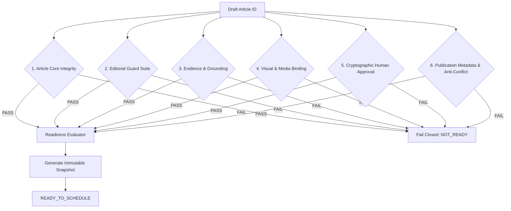
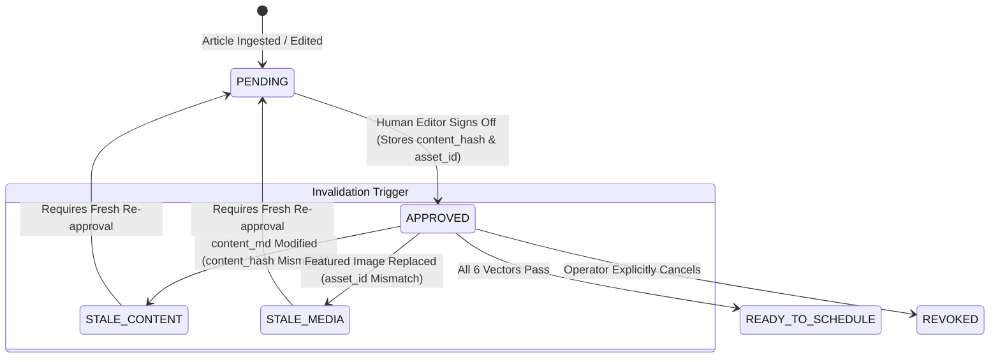

# 🏛️ RancangLoka Publication Readiness Gate — Architecture & System Design (PUBLICATION-0)

**Document Version:** 1.0.0  
**Milestone:** PUBLICATION-0 — Publication Readiness Gate Audit & Design  
**Status:** COMPLETE (Audit & Architecture Specification Frozen — Zero Implementation / Zero Production Mutation)  
**Date:** 2026-09-07  

---

## 1. Executive Summary & Design Scope

Milestone **PUBLICATION-0 (Publication Readiness Gate)** establishes the authoritative, deterministic, and fail-closed quality gate that validates whether an ingested draft article has achieved absolute editorial, technical, visual, and human readiness to be scheduled for publication:

$$\text{DRAFT} + \text{EDITORIAL GUARDS} + \text{EVIDENCE / CITATIONS} + \text{MEDIA READINESS} + \text{HUMAN APPROVAL} + \text{METADATA} \longrightarrow \mathbf{READY\_TO\_SCHEDULE}$$

### Core Boundaries & Restrictions
1. **No Scheduling:** PUBLICATION-0 does **NOT** decide publication dates, times, pacing, or publishing calendars.
2. **No Publication:** PUBLICATION-0 does **NOT** mutate `articles.status` to `'published'`. `AUTO_PUBLISH = OFF`.
3. **No Content Generation:** PUBLICATION-0 does **NOT** synthesize, rewrite, or prompt LLMs. `MODEL_CALLS = 0`.
4. **No Image Generation:** Visual asset generation remains decoupled under LokaMedia. `AUTO_FAL = OFF`.
5. **Pure Evaluation Gate:** It evaluates current persisted evidence and outputs an immutable, auditable **Readiness Snapshot**.

---

## 2. System Audit of Existing Production Architecture

A comprehensive audit of the active RancangLoka CMS (`rancangloka-astro`) and Hermes staging platform (`/opt/data/rancangloka`) reveals the following architectural baselines:

### 2.1 Article Status & Metadata Schema (`articles` table in D1)
- **Status Column:** `articles.status` currently permits `'draft' | 'published' | 'scheduled'`.
  - Ingestion via Hermes forcedly persists `status = 'draft'` (enforced by `hermes-ingest.ts`).
  - Automated publishing is disabled (`AUTO_PUBLISH = OFF`).
- **Core Content Columns:** `id`, `slug`, `title`, `description`, `content_md`, `content_html`, `category_id`, `author_id`.
- **Integrity & Identity Columns:**
  - `content_hash`: SHA-256 digest of normalized Markdown body (`lib/seo.ts`).
  - `reading_time_minutes`, `key_takeaways` (JSON array), `focus_keyword`.
- **Flags & Controls (Migration 0004):**
  - `is_sponsored` (0/1): Marks commercial/sponsored content.
  - `disable_internal_links` (0/1): Inhibits automated cross-linking.
  - `is_featured` (0/1), `is_trending` (0/1).
- **Taxonomy & Attribution:**
  - `categories` table: 6 canonical categories (`arsitektur-dan-renovasi`, `material-bangunan`, `tata-ruang-dan-denah`, `struktur-dan-pondasi`, `atap-dan-ventilasi`, `estimasi-biaya-dan-proyek`).
  - `authors` table: Enforces canonical desk author (`RancangLoka Editorial Desk`, slug: `dewan-redaksi-spasial`, migration 0003).

### 2.2 Ingestion Provenance (`article_ingest_receipts` table)
- M2M receipts persist cryptographic provenance:
  - `job_id`, `source`, `source_article_id`, `content_sha256`, `article_content_hash`, `contract_version`, `created_at`.
  - Guaranteed 1:1 binding between ingested draft and Hermes outbox dispatch.

### 2.3 Media Foundation & Binding (`media_assets` and `article_media` tables)
- **Binary Status (`media_assets.status`):**
  - Restricted strictly to binary lifecycle: `PENDING`, `UPLOADING`, `VALIDATED`, `REJECTED`, `FAILED`.
  - Content-addressable R2 storage key: `media/images/<sha256>.<ext>`.
  - MIME types allowed: `image/jpeg`, `image/png`, `image/webp`.
- **Relational Binding (`article_media`):**
  - `article_id REFERENCES articles(id)`, `asset_id REFERENCES media_assets(asset_id)`.
  - `role IN ('featured', 'inline')`, `slot_key` (default `'primary'`).
  - `is_active IN (0, 1)`: Active displayed asset vs historical replacement.
  - Only active bindings with `role = 'featured'` and `media_assets.status = 'VALIDATED'` constitute valid media readiness.
- **Media Job Queue (`media_jobs`):**
  - Managed by MEDIA-1: `PENDING -> IN_PROGRESS -> READY_TO_UPLOAD -> UPLOADING -> ATTACHED | FAILED | SKIPPED`.

### 2.4 Editorial Guards Subsystem (Hermes)
Proven, deterministic guard scripts located in `/opt/data/skills/rancangloka-editorial/scripts/`:
- `article_contract_guard.py`: Enforces H2/H3 structure, takeaway counts, length bounds, tone, and banned formatting.
- `evidence_gate.py`: Validates claims, sources, and factual grounding against Source Pack & Evidence Pack.
- `citation_guard_v2.py`: Verifies quote accuracy, domain trust, and bibliography resolution.
- `monetary_guard.py`: Zero-tolerance filter against pricing claims, exact Rupiah costs, budget estimates, or unverified commercial promises.

### 2.5 Audit Finding: Missing Approval & Readiness State
- **Gap Identified:** Cloudflare D1 currently has **no dedicated table or columns** tracking human editorial approval, approval invalidation hashes, or publication readiness snapshots.
- **Architectural Imperative:** Human approval and readiness state must **never** be shoehorned into `articles.status` or loosely tracked in unstructured comments. A dedicated, relational, audit-logged schema is required.

---

## 3. Separation of State Domains

To prevent state conflation, the platform enforces strict decoupling across five independent state domains:

| State Domain | Authorized Values | Authoritative Storage | Mutation Authority |
| :--- | :--- | :--- | :--- |
| **Article Status** | `draft`, `published`, `scheduled` | D1 `articles.status` | CMS Core / Ingest (Forced `draft`) |
| **Media Status** | `VALIDATED`, `PENDING`, `REJECTED` | D1 `media_assets.status` | LokaMedia Service (`/api/internal/v1/media/upload`) |
| **Orchestration State** | `QUEUED` $\to$ `WAITING_MEDIA` $\to$ `READY_FOR_REVIEW` | Hermes `orchestrator.db` | Editorial Orchestrator Engine (`rl_orchestrator_core.py`) |
| **Publication Readiness** | `NOT_READY`, `READY_TO_SCHEDULE`, `BLOCKED` | D1 `article_publication_readiness` | Publication Readiness Gate (PUBLICATION-0) |
| **Editorial Approval** | `PENDING`, `APPROVED`, `REJECTED`, `STALE` | D1 `article_editorial_approvals` | Human Editor-in-Chief / Authorized Operator |

### Forward Publication Lifecycle
```text
[ CMS Draft Created ] (status = draft)
         ↓
[ Orchestrator / LokaMedia Attached ] (WAITING_MEDIA → READY_FOR_REVIEW)
         ↓
[ Publication Readiness Gate (PUBLICATION-0) ]
         ├── Incomplete / Guard Fail / Stale Approval ──→ [ NOT_READY / BLOCKED ]
         └── All Checks PASS + Valid Human Approval ────→ [ READY_TO_SCHEDULE ]
                                                                 ↓
                                           [ Adaptive Planner (PUBLICATION-1) ]
                                                                 ↓
                                           [ Scheduled Queue ] (status = scheduled)
                                                                 ↓
                                           [ Canonical Publisher (PUBLICATION-2) ]
                                                                 ↓
                                           [ Live Public Article ] (status = published)
```

---

## 4. Deterministic Readiness Requirements

An article achieves `READY_TO_SCHEDULE = YES` if and only if **all** of the following six verification vectors pass simultaneously:



### Vector 1: Article Core Integrity
- `articles.status == 'draft'`. (Articles in `'published'` or `'scheduled'` cannot re-enter the gate).
- `content_md` is non-empty ($\ge 300$ words).
- `content_html` rendered cleanly without unclosed tags or syntax anomalies.
- `slug` is valid URL-safe kebab-case (`^[a-z0-9]+(?:-[a-z0-9]+)*$`).
- `title` is non-empty ($40 \le \text{length} \le 70$ characters).
- `description` (meta description) is non-empty ($100 \le \text{length} \le 160$ characters).
- `category_id` references a valid active row in `categories`.
- `author_id` references a valid canonical author in `authors` (`RancangLoka Editorial Desk`).

### Vector 2: Editorial Guard Suite
- `article_contract_guard`: **PASS** (Zero placeholder tags like `TODO`, `[EVIDENCE NEEDED]`, valid H2/H3 sectioning, valid takeaways).
- `monetary_guard`: **PASS** (Zero exact price points, zero unverified monetary promises like `Rp ...`, `IDR`, `budget`, `ongkos`).
- `editorial_qa`: **PASS** (Indonesian orthography, no robotic sentence padding, tone adheres to RancangLoka Editorial DNA).

### Vector 3: Evidence & Citations
- `evidence_gate`: **PASS** (Every factual architectural claim mapped to an admitted primary source in `evidence-pack.json`).
- `citation_guard_v2`: **PASS** (Zero ungrounded assertions, zero hallucinated citations, trusted domain registry verification).

### Vector 4: Visual & Media Readiness
- Exactly one active binding in `article_media` where `role = 'featured'` and `is_active = 1`.
- Bound `asset_id` exists in `media_assets` with:
  - `status == 'VALIDATED'`.
  - `media_type == 'image'`.
  - `mime_type IN ('image/jpeg', 'image/png', 'image/webp')`.
  - Resolution meets minimum standards ($1200 \times 675$, aspect ratio $16:9$).
  - `alt_text` is non-empty, descriptive, and contains no spammy keyword repetition.

### Vector 5: Human Editorial Approval
- An authoritative approval record exists in `article_editorial_approvals`.
- `approval_status == 'APPROVED'`.
- Cryptographic content match: `approval.approved_content_hash == articles.content_hash`.
- Cryptographic media match: `approval.approved_asset_id == active_featured_binding.asset_id`.
- If `articles.content_hash` differs from `approved_content_hash`, approval is automatically classified as **STALE** and rejected.

### Vector 6: Publication Metadata & Anti-Conflict
- No active publication conflict or cannibalization flag against existing live articles (`/api/internal/v1/publication-inventory`).
- `disable_internal_links` properly resolved according to `is_sponsored` flag.
- `key_takeaways` JSON parseable with $3 \le \text{items} \le 5$.

---

## 5. Explicit Human Approval Model & Invalidation Rules

Human oversight is a strict, non-bypassable pre-condition for publication readiness.

### 5.1 Proposed Relational Schema: `article_editorial_approvals`
```sql
CREATE TABLE IF NOT EXISTS article_editorial_approvals (
    id INTEGER PRIMARY KEY AUTOINCREMENT,
    article_id INTEGER NOT NULL REFERENCES articles(id) ON DELETE CASCADE,
    approved_by TEXT NOT NULL,                        -- Operator username / authenticated email
    approved_role TEXT NOT NULL,                      -- 'editor_in_chief' | 'managing_editor'
    approval_status TEXT NOT NULL DEFAULT 'APPROVED', -- 'APPROVED' | 'REJECTED' | 'REVOKED'
    approved_content_hash TEXT NOT NULL,              -- SHA-256 of article content_md at approval time
    approved_asset_id TEXT NOT NULL,                  -- asset_id of featured media at approval time
    notes TEXT,
    created_at DATETIME NOT NULL DEFAULT CURRENT_TIMESTAMP,
    updated_at DATETIME NOT NULL DEFAULT CURRENT_TIMESTAMP,

    CHECK (approval_status IN ('APPROVED', 'REJECTED', 'REVOKED'))
);

CREATE INDEX IF NOT EXISTS idx_approvals_article_status 
ON article_editorial_approvals(article_id, approval_status);
```

### 5.2 Strict Invalidation & Staleness Rules



1. **Content Mutation Invalidation:**
   - If any character in `articles.content_md` is altered, `lib/seo.ts` recomputes `articles.content_hash`.
   - On evaluation, the Gate checks:
     $$\text{articles.content\_hash} \stackrel{?}{=} \text{approval.approved\_content\_hash}$$
   - If unequal, the gate fails immediately with code `APPROVAL_STALE_CONTENT_MUTATED`.
2. **Featured Media Invalidation:**
   - **Architectural Justification:** In architectural publishing, visual imagery is integral to editorial context and credibility (e.g., structural details, material finishes). If a cover image is replaced after editorial review, the visual assertion has changed.
   - The gate checks:
     $$\text{active\_article\_media.asset\_id} \stackrel{?}{=} \text{approval.approved\_asset\_id}$$
   - If unequal, the gate fails with code `APPROVAL_STALE_MEDIA_REPLACED`.
3. **No Silent Inheritance:**
   - Approvals are cryptographically tied to exact content digests. Under no circumstances may an approval record be transferred or inherited across revisions.

---

## 6. Readiness Evaluation Snapshot

Every evaluation generates an immutable, structured snapshot record persisted in `article_publication_readiness` for auditability and downstream consumption by the planner:

### 6.1 Proposed Relational Schema: `article_publication_readiness`
```sql
CREATE TABLE IF NOT EXISTS article_publication_readiness (
    id INTEGER PRIMARY KEY AUTOINCREMENT,
    article_id INTEGER NOT NULL REFERENCES articles(id) ON DELETE CASCADE,
    is_ready INTEGER NOT NULL DEFAULT 0,              -- 1 = READY_TO_SCHEDULE, 0 = NOT_READY
    overall_status TEXT NOT NULL,                     -- 'READY_TO_SCHEDULE' | 'NOT_READY' | 'BLOCKED'
    content_hash TEXT NOT NULL,
    snapshot_json TEXT NOT NULL,                      -- Structured JSON snapshot of all evaluation vectors
    evaluated_at DATETIME NOT NULL DEFAULT CURRENT_TIMESTAMP,

    CHECK (is_ready IN (0, 1)),
    CHECK (overall_status IN ('READY_TO_SCHEDULE', 'NOT_READY', 'BLOCKED'))
);

CREATE INDEX IF NOT EXISTS idx_readiness_article 
ON article_publication_readiness(article_id, evaluated_at DESC);
```

### 6.2 Snapshot JSON Payload Structure
```json
{
  "schema_version": 1,
  "article_id": 42,
  "slug": "perbedaan-atap-metal-dan-genteng-beton-untuk-rumah-tropis",
  "evaluated_at": "2026-09-07T10:50:00Z",
  "is_ready": true,
  "overall_status": "READY_TO_SCHEDULE",
  "content_hash": "0b88aa50b67259013d00757825356877ae3a78061d9151dc446eb0e8d0f419cf",
  "vectors": {
    "article_integrity": {
      "status": "PASS",
      "article_status": "draft",
      "title_len": 58,
      "desc_len": 142,
      "category": "atap-dan-ventilasi",
      "author": "RancangLoka Editorial Desk"
    },
    "editorial_guards": {
      "status": "PASS",
      "article_contract": "PASS",
      "monetary_guard": "PASS",
      "editorial_qa": "PASS"
    },
    "evidence_and_citations": {
      "status": "PASS",
      "evidence_gate": "PASS",
      "citation_guard": "PASS",
      "source_count": 3
    },
    "visual_media": {
      "status": "PASS",
      "asset_id": "ast_9f8e21a4bc",
      "storage_key": "media/images/9f8e21a4bc...webp",
      "status": "VALIDATED",
      "aspect_ratio": "16:9",
      "width": 1200,
      "height": 675,
      "alt_text": "Perbandingan visual rangka atap metal dan genteng beton"
    },
    "human_approval": {
      "status": "PASS",
      "approved_by": "editor@rancangloka.com",
      "approved_at": "2026-09-07T10:45:00Z",
      "content_hash_matched": true,
      "media_asset_matched": true
    },
    "publication_metadata": {
      "status": "PASS",
      "anti_conflict": "PASS",
      "takeaways_count": 3
    }
  },
  "blockers": []
}
```

---

## 7. Machine-Readable Failure Codes

When an article fails any readiness pre-condition, the gate outputs explicit, deterministic blocker codes:

| Blocker Code | Category | Root Cause Description |
| :--- | :--- | :--- |
| `ARTICLE_NOT_DRAFT` | Core Integrity | Article status is `'published'` or `'scheduled'` instead of `'draft'`. |
| `ARTICLE_CONTENT_EMPTY` | Core Integrity | Markdown body is missing or below minimum word count. |
| `TITLE_LENGTH_INVALID` | Core Integrity | Title length is $< 40$ or $> 70$ characters. |
| `DESCRIPTION_INVALID` | Core Integrity | Meta description missing or outside 100–160 character boundary. |
| `CANONICAL_AUTHOR_REQUIRED`| Core Integrity | Author is not assigned to `RancangLoka Editorial Desk`. |
| `CATEGORY_INVALID` | Core Integrity | Category does not match one of the 6 official taxonomy IDs. |
| `ARTICLE_CONTRACT_FAILED` | Guards | Heading structure, word count, or formatting contract broken. |
| `MONETARY_GUARD_FAILED` | Guards | Price point, Rupiah symbol, or commercial cost claims detected. |
| `EVIDENCE_GATE_FAILED` | Grounding | Fact claim missing matching evidence reference in Evidence Pack. |
| `CITATION_GUARD_FAILED` | Grounding | Citation link unresolvable or points to untrusted domain. |
| `FEATURED_MEDIA_MISSING` | Visual | No active binding with `role = 'featured'` in `article_media`. |
| `MEDIA_NOT_VALIDATED` | Visual | Bound `media_assets.status` is not `'VALIDATED'`. |
| `MEDIA_DIMENSIONS_INVALID`| Visual | Image dimensions $< 1200\times675$ or aspect ratio not $16:9$. |
| `ALT_TEXT_MISSING` | Visual | Featured image alt text is empty or purely whitespace. |
| `APPROVAL_MISSING` | Human | No approval record exists for this article ID. |
| `APPROVAL_STATUS_REJECTED`| Human | Editor explicitly marked approval as `REJECTED` or `REVOKED`. |
| `APPROVAL_STALE_CONTENT` | Human | Content hash has changed since human sign-off was recorded. |
| `APPROVAL_STALE_MEDIA` | Human | Featured image has been swapped since human sign-off was recorded. |
| `INVENTORY_CONFLICT` | Metadata | Slug or core concept collides with active live publication. |
| `TAKEAWAYS_INVALID` | Metadata | `key_takeaways` JSON array has fewer than 3 or more than 5 items. |

---

## 8. Idempotency & Concurrency Guarantees

1. **Read-Only Inspection:**
   - Readiness evaluation performs zero mutations on `articles`, `categories`, `authors`, `article_media`, or `media_assets`.
   - Repeated calls on identical article state produce byte-for-byte identical snapshot payloads and blocker codes.
2. **Snapshot Idempotency:**
   - If an unexpired snapshot for the exact same `(article_id, content_hash)` exists and is less than 60 seconds old, the gate can return the cached snapshot without re-running heavy guard checks.
3. **Fail-Closed Execution:**
   - If any dependency is unreachable (e.g., D1 query timeout or inventory connection issue), the gate automatically returns `overall_status = 'BLOCKED'` and `is_ready = 0`.

---

## 9. Security & Access Boundaries

1. **Zero Secret Handling:**
   - The gate reads only public article bodies and internal relational metadata. No signing keys, auth tokens, device secrets, or passphrases are ever touched or logged.
2. **Privilege Separation:**
   - **Readiness Gate Endpoint:** Can read article data and write to `article_publication_readiness`. It possesses **zero** authority to update `articles.status` or `articles.published_at`.
   - **Human Approval Endpoint:** Restricted to authenticated editorial operators via existing admin session/JWT authentication.
3. **Hard Invariants Maintained:**
   - `AUTO_PUBLISH = OFF`.
   - `AUTO_FAL = OFF`.
   - `ARTICLE_REMAINS_DRAFT = YES`.

---

## 10. Downstream Handoff to PUBLICATION-1 (Adaptive Planner)

The Publication Readiness Gate provides a clean, decoupled boundary for the future **PUBLICATION-1 Adaptive Planner**:

```text
[ PUBLICATION-0 ] ── Writes Snapshot ──→ [ article_publication_readiness ]
                                                        │
                                                        ▼ (SELECT WHERE is_ready = 1)
                                          [ PUBLICATION-1 Adaptive Planner ]
                                                        │
                                                        ▼ (Calculates publish window & quota)
                                          [ article_publication_schedules ]
```

- The Planner queries solely for articles having an active `is_ready = 1` snapshot matching current `articles.content_hash`.
- The Readiness Gate does **not** know or care about:
  - Daily/weekly publication caps (e.g., max 2 articles/day).
  - Peak reader engagement time slots.
  - Social media dispatch timing.
- All temporal planning is deferred cleanly to PUBLICATION-1.

---

## 11. Milestone Verification Checklist

- [x] Actual D1 schema, migrations (0001–0006), and endpoints audited.
- [x] Absolute separation of Article, Media, Orchestration, Readiness, and Approval statuses defined.
- [x] All 6 readiness vectors formulated with deterministic preconditions.
- [x] Explicit human approval model defined with cryptographic content-hash and media-binding invalidation.
- [x] Auditable, immutable Readiness Snapshot payload designed.
- [x] Machine-readable failure codes specified.
- [x] Read-only idempotency and fail-closed security guarantees documented.
- [x] Handoff contract to PUBLICATION-1 Adaptive Planner defined.
- [x] Zero model calls (`MODEL_CALLS = 0`).
- [x] Zero production mutations (`PRODUCTION_MUTATION = NONE`).
- [x] `AUTO_PUBLISH = OFF`, `AUTO_FAL = OFF`.
